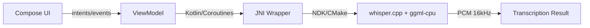

# WhispersCpp-Android

> **Offline speech‑to‑text for Android** powered by [`whisper.cpp`](https://github.com/ggerganov/whisper.cpp). This template provides a clean **Kotlin (Jetpack Compose) + JNI (C/C++)** stack for **fully on‑device** transcription, with CI workflows for Releases, Wiki, and GitHub Pages.

---

<p><a href="index.html" target=_self title="Seperate Page">Go to index</a></p>

<div align="center">

[](https://github.com/ishizuki-tech/WhispersCpp-Android/actions)
[](https://github.com/ishizuki-tech/WhispersCpp-Android/releases)
[](LICENSE)

</div>

---

## ✨ Highlights

* **100% on‑device** Whisper inference (no network calls)
* **Compose UI** for recording, playback, and model/language selection
* **JNI bridge** for model load + inference (`whisper_init_from_file`, `whisper_full`, etc.)
* **Android‑safe native build** (CPU‑only ggml backends; GPU/BLAS/SYCL/x86 excluded)
* **Multilingual ready** (tested: English / Japanese / Swahili)
* **Reproducible CI**: build → release assets → Pages (Glass UI) → Wiki Downloads

## 🔗 Useful Links

* **Model Downloads Wiki:** [https://github.com/ishizuki-tech/WhispersCpp-Android/wiki/Downloads](https://github.com/ishizuki-tech/WhispersCpp-Android/wiki/Downloads)
* **GitHub Pages (Glass UI downloads):** [https://ishizuki-tech.github.io/WhispersCpp-Android/](https://ishizuki-tech.github.io/WhispersCpp-Android/)
* **Releases:** [https://github.com/ishizuki-tech/WhispersCpp-Android/releases](https://github.com/ishizuki-tech/WhispersCpp-Android/releases)

> If the Wiki/Pages show 404 initially, run the publish workflow once and refresh after a minute.

## 📱 Quick Start (APK)

1. Open **[Releases](https://github.com/ishizuki-tech/WhispersCpp-Android/releases)** and download the latest `.apk`.
2. Install on device (Android 8.0+). Enable **Install unknown apps** if needed.
3. On first launch, pick your **Language** and **Model** (see *Model Setup*).

> Tip: If the app says *model not found*, use the file picker (if enabled) or place the model at the suggested path shown in the UI.

## 🏗️ Project Structure

```
WhispersCpp-Android/
 ├─ app/                    # Android app (Compose UI, ViewModels)
 ├─ nativelib/              # JNI bridge + whisper.cpp/ggml integration
 ├─ .github/workflows/      # CI pipelines (build/release/pages/wiki)
 ├─ build.gradle(.kts)
 ├─ settings.gradle(.kts)
 ├─ LICENSE
 └─ README.md
```

## ⚙️ Build From Source

### Requirements

* **Android Studio** (Giraffe+ recommended)
* **JDK** 17
* **Android NDK** `28.0.12433566` (aligns with `ndkVersion` in Gradle)
* **ABIs**: `arm64-v8a` (primary), `armeabi-v7a` (optional)

### Clone (with submodules if used)

```bash
git clone https://github.com/ishizuki-tech/WhispersCpp-Android.git
cd WhispersCpp-Android
# If whisper.cpp is a submodule:
git submodule update --init --recursive
```

### Build

```bash
# Debug
./gradlew :app:assembleDebug
# Release
./gradlew :app:assembleRelease
```

### Install (ADB)

```bash
adb install -r app/build/outputs/apk/debug/app-debug.apk
# or
adb install -r app/build/outputs/apk/release/app-release.apk
```

## 🎧 Model Setup (BYOM: Bring Your Own Model)

Models are **not bundled** by default. Use **ggml/gguf** models compatible with `whisper.cpp`.

| Model          | Params | Typical Size | Notes                     |
| -------------- | -----: | -----------: | ------------------------- |
| tiny / tiny.en |   ~39M |     20–30 MB | Fastest, lower accuracy   |
| base / base.en |   ~74M |     50–90 MB | Good balance              |
| small          |  ~244M |   200–300 MB | Better accuracy, slower   |
| medium         |  ~769M |   1.3–1.5 GB | High accuracy, heavy      |
| large v2/v3    |  ~1.5B |   2.9–3.2 GB | Best accuracy, very heavy |

1. Download a model (see **[Downloads Wiki](https://github.com/ishizuki-tech/WhispersCpp-Android/wiki/Downloads)** for curated links).
2. Place it on‑device (e.g., `Android/data/<app-id>/files/models/`) *or* pick via in‑app file picker.
3. Select the model in **Settings** and start recording.

> For low‑RAM devices, start with `tiny`/`base`. Prefer `arm64-v8a` devices for best performance.

## ⚙️ Native Build (JNI + CMake)

Android build is **CPU‑only** for stability and small binaries. Typical configuration:

* C standard: **C11**, C++: **C++17**
* `-fPIC` and other Android defaults via NDK/Gradle
* **Include**: `ggml-cpu/*.cpp`, `whisper.cpp`
* **Exclude**: GPU/BLAS/SYCL/x86 backends
* ABIs: `arm64-v8a` (+ `armeabi-v7a` optional)

> If you hit undefined ggml symbols (e.g., `ggml_cpu_extra_work_size`), ensure all required `ggml-cpu/*.cpp` files and matching headers are compiled.

## 🚀 CI/CD (GitHub Actions)

Workflows support:

* Build **Debug/Release** artifacts
* Publish **GitHub Releases** (APK/AAB)
* Generate **GitHub Pages** (Glass UI downloads)
* Update **Wiki** (Downloads, model specs, release history)

**Notes**

* Set `permissions: contents: write` (and `pages: write` if publishing Pages).
* Wiki pushes generally work with the default `GITHUB_TOKEN` once **Wiki is enabled** for the repo.
* First‑time Wiki/Pages may 404 briefly until initial commit/deploy completes.
* Some jobs can **fallback** to latest Release assets if local artifacts are missing.

## 🧪 Local Testing

```bash
./gradlew lint test
adb logcat | grep -i whisper
```

Expected lines:

```
I/JNI-Whisper: model loaded successfully
I/JNI-Whisper: transcription started...
```

## ⚡ Performance Tips

* Prefer **`arm64-v8a`** builds on modern devices
* Use **smaller models** (tiny/base) for faster response
* Keep recordings short; avoid background heavy apps
* Ensure **battery saver** and **thermal throttling** aren’t limiting CPU

## 🤝 Contributing

1. Open an issue to discuss changes
2. Follow existing styles (KDoc for Kotlin; clear comments for C/CMake)
3. Keep CI green; update tests/docs as needed

## 📝 License

Released under the **MIT License** (see [LICENSE](LICENSE)). Third‑party components (whisper.cpp, ggml) retain their licenses.

## 🙏 Acknowledgements

* [`whisper.cpp`](https://github.com/ggerganov/whisper.cpp) — Georgi Gerganov & contributors
* `ggml` community and the Android NDK team
* Everyone filing issues and testing on real devices 🙌

---

## 🧭 Table of Contents

* [Overview](#overview)
* [Architecture](#architecture)
* [Requirements](#requirements)
* [Project Structure](#project-structure)
* [Quick Start (APK)](#-quick-start-apk)
* [Build From Source](#-build-from-source)
* [Model Guide (ggml/gguf)](#-model-guide-ggmlgguf)

    * [Recommended Models & Links](#recommended-models--links)
    * [Quantization Cheatsheet](#quantization-cheatsheet)
    * [Where to Put Models on Android](#where-to-put-models-on-android)
    * [Converting / Verifying Models](#converting--verifying-models)
* [Performance & Memory Guide](#-performance--memory-guide)
* [CI/CD Workflows](#-cicd-workflows)
* [Troubleshooting](#-troubleshooting)
* [Security & Privacy](#-security--privacy)
* [Contributing](#-contributing)
* [License](#-license)
* [Acknowledgements](#-acknowledgements)

---

## Overview

WhispersCpp-Android integrates [`whisper.cpp`](https://github.com/ggerganov/whisper.cpp) with a modern Android app built in **Kotlin + Jetpack Compose**. It aims to be a **minimal, production‑ready template** for **fully on‑device** transcription (English/Japanese/Swahili verified).

**Key links**

* 📦 **Releases:** [https://github.com/ishizuki-tech/WhispersCpp-Android/releases](https://github.com/ishizuki-tech/WhispersCpp-Android/releases)
* 🌐 **GitHub Pages (Glass UI):** [https://ishizuki-tech.github.io/WhispersCpp-Android/](https://ishizuki-tech.github.io/WhispersCpp-Android/)
* 📘 **Model Downloads Wiki:** [https://github.com/ishizuki-tech/WhispersCpp-Android/wiki/Downloads](https://github.com/ishizuki-tech/WhispersCpp-Android/wiki/Downloads)
* 🔧 **whisper.cpp upstream:** [https://github.com/ggerganov/whisper.cpp](https://github.com/ggerganov/whisper.cpp)
* 📄 **Original Whisper paper (OpenAI):** [https://arxiv.org/abs/2212.04356](https://arxiv.org/abs/2212.04356)

---

## Architecture



* **Compose UI:** Recording controls, language/model dropdowns, file picker.
* **ViewModel:** Business logic, state management, background tasks.
* **JNI Wrapper:** Thin C/C++ layer calling `whisper_init_from_file`, `whisper_full`, etc.
* **Native Core:** CPU‑only build of `whisper.cpp` and `ggml-cpu` for Android safety/stability.

**Threading model**

* Audio capture on a dedicated coroutine/dispatcher
* JNI calls are serialized; results emitted to UI state
* Back‑pressure via buffers for 16kHz PCM (mono)

---

## Requirements

* **Android Studio:** Giraffe+ (2023.3) or newer
* **JDK:** 17
* **NDK:** `28.0.12433566` (match `ndkVersion` in Gradle)
* **CMake:** auto‑provisioned by AGP (≥3.22)
* **ABIs:** `arm64-v8a` (primary), `armeabi-v7a` (optional)
* **Min/Target SDK:** see `app/build.gradle(.kts)`

---

## Project Structure

```
WhispersCpp-Android/
 ├─ app/                      # Compose UI, ViewModels, DI, permissions
 ├─ nativelib/                # JNI + CMake + whisper.cpp/ggml integration
 ├─ .github/workflows/        # CI pipelines (build/release/pages/wiki)
 ├─ build.gradle(.kts)
 ├─ settings.gradle(.kts)
 ├─ LICENSE
 └─ README.md
```

---

## 📱 Quick Start (APK)

1. Download latest **APK** from **[Releases](https://github.com/ishizuki-tech/WhispersCpp-Android/releases)**.
2. Install on device (Android 8.0+). Enable *Install unknown apps* if prompted.
3. On first launch choose **Language** and **Model** (see the Model Guide below).

> Tip: If you see *model not found*, place a compatible model (`.bin` ggml or `.gguf`) at the suggested path shown in the app or use the file picker.

---

## 🧰 Build From Source

### Clone

```bash
git clone https://github.com/ishizuki-tech/WhispersCpp-Android.git
cd WhispersCpp-Android
# If whisper.cpp is tracked as a submodule (optional)
git submodule update --init --recursive
```

### Build (Gradle)

```bash
# Debug
./gradlew :app:assembleDebug
# Release
./gradlew :app:assembleRelease
```

### Install (ADB)

```bash
adb install -r app/build/outputs/apk/debug/app-debug.apk
# or
adb install -r app/build/outputs/apk/release/app-release.apk
```

---

## 🎧 Model Guide (ggml/gguf)

This project **does not bundle models**. Bring Your Own Model (BYOM) compatible with `whisper.cpp`.

### Recommended Models & Links

* **Upstream (reference)**: [https://github.com/ggerganov/whisper.cpp](https://github.com/ggerganov/whisper.cpp)
* **Hugging Face mirrors (examples)**:

    * `openai/whisper-*` collections
    * `ggerganov/whisper.cpp` compatible dumps
    * `ggml-org/models` curated sets
      *(Use models compatible with `whisper.cpp`; filenames often include `ggml` or `gguf` and quant level, e.g., `q5_1`.)*

| Family         | Params | Typical Size | Suggested Use                | Example Filenames                    |
| -------------- | -----: | -----------: | ---------------------------- | ------------------------------------ |
| tiny / tiny.en |   ~39M |     20–30 MB | low‑end devices / fast tests | `ggml-tiny-q5_1.bin`, `tiny.en.gguf` |
| base / base.en |   ~74M |     50–90 MB | balance of speed/quality     | `ggml-base-q5_1.bin`, `base.en.gguf` |
| small          |  ~244M |   200–300 MB | better accuracy, slower      | `small-q5_1.gguf`                    |
| medium         |  ~769M |   1.3–1.5 GB | high accuracy, heavy         | `medium-q5_1.gguf`                   |
| large v2/v3    |  ~1.5B |   2.9–3.2 GB | best accuracy, very heavy    | `large-v3-q5_1.gguf`                 |

> For device guidance, curated links, checksums, and speed notes, see the **[Model Downloads Wiki](https://github.com/ishizuki-tech/WhispersCpp-Android/wiki/Downloads)**.

### Quantization Cheatsheet

* `q5_1` → great all‑rounder for mobile (quality vs. size)
* `q4_0` → smaller/faster, a bit more loss
* `q8_0` → larger/faster on high‑end devices
* Prefer **`arm64-v8a`** devices for FP16/NEON benefits

### Where to Put Models on Android

Common options (may differ by build):

```
Android/data/<your.app.id>/files/models/
# or app-internal path surfaced by the UI
```

You can also keep models in external storage and select via **in‑app file picker** if enabled.

### Converting / Verifying Models

* **Conversion (PC):** Use `whisper.cpp` tools to convert/checkpoints to `ggml`/`gguf`.
* **Verify (device):** The app logs model load outcome. Check with:

  ```bash
  adb logcat | grep -i whisper
  ```

  Expected lines: `model loaded successfully`, `transcription started…`

---

## 📘 Curated Models (from `meta/models.json`)

The CI can generate `meta/models.json` for downstream pages and the Wiki. Current curated entries:

| Name                                                                                                       | Params |   Size | Speed  | Notes                   |
| ---------------------------------------------------------------------------------------------------------- | -----: | -----: | ------ | ----------------------- |
| [ggml-tiny-q5_1.bin](https://huggingface.co/ggerganov/whisper.cpp/blob/main/ggml-tiny-q5_1.bin)            |   39 M |  32 MB | 32× RT | Multilingual (EN/JP/SW) |
| [ggml-base-q5_1.bin](https://huggingface.co/ggerganov/whisper.cpp/blob/main/ggml-base-q5_1.bin)            |   74 M |  57 MB | 16× RT | Balanced multilingual   |
| [ggml-small-q5_1.bin](https://huggingface.co/ggerganov/whisper.cpp/blob/main/ggml-small-q5_1.bin)          |  244 M | 182 MB | 6× RT  | High accuracy           |
| [ggml-model-q4_0.bin](https://huggingface.co/jboat/jacaranda-asr-whispercpp/blob/main/ggml-model-q4_0.bin) |  769 M | 444 MB | 3× RT  | Swahili-tuned           |

> **Notes**
>
> * The `generated` field in the JSON is a timestamp for provenance.
> * "Speed" is indicative and device‑dependent. Use it for relative comparison only.
> * Prefer using direct download links (e.g., `.../resolve/main/<file>`) in automation.
> * Consider tracking checksums (SHA256) and licenses alongside each entry.

### JSON snippet (for reference)

```json
{
  "generated": "${DATE}",
  "models": [
    {"name":"ggml-tiny-q5_1.bin","params":"39 M","size":"32 MB","speed":"32× RT","notes":"Multilingual (EN/JP/SW)","source":"https://huggingface.co/ggerganov/whisper.cpp/blob/main/ggml-tiny-q5_1.bin"},
    {"name":"ggml-base-q5_1.bin","params":"74 M","size":"57 MB","speed":"16× RT","notes":"Balanced multilingual","source":"https://huggingface.co/ggerganov/whisper.cpp/blob/main/ggml-base-q5_1.bin"},
    {"name":"ggml-small-q5_1.bin","params":"244 M","size":"182 MB","speed":"6× RT","notes":"High accuracy","source":"https://huggingface.co/ggerganov/whisper.cpp/blob/main/ggml-small-q5_1.bin"},
    {"name":"ggml-model-q4_0.bin","params":"769 M","size":"444 MB","speed":"3× RT","notes":"Swahili-tuned","source":"https://huggingface.co/jboat/jacaranda-asr-whispercpp/blob/main/ggml-model-q4_0.bin"}
  ]
}
```

#### Suggested enhancements

* Use ISO‑8601 UTC for `generated`, e.g. `$(date -u +"%Y-%m-%dT%H:%M:%SZ")`
* Add fields: `format` (ggml/gguf), `quant` (q5_1, q4_0), `checksum_sha256`, `license`, `lang`, `notes_long`
* For automation, prefer `source_resolve`: `https://huggingface.co/<repo>/resolve/main/<file>`

## 🚀 Performance & Memory Guide

**General guidance**

* Start with **tiny/base** on entry‑level devices
* Keep recordings short; avoid background heavy apps
* Ensure battery saver is off; watch for thermal throttling

**Indicative (ballpark) measurements**

| Device Class   | Model      | Throughput (× real‑time) | Notes                      |
| -------------- | ---------- | -----------------------: | -------------------------- |
| High‑end ARMv8 | small‑q5_1 |                ~0.8–1.1× | Smooth on recent flagships |
| Mid‑range      | base‑q5_1  |                ~0.9–1.3× | Good compromise            |
| Entry          | tiny‑q5_1  |                ~1.2–1.8× | Fastest / least RAM        |

Memory tips

* Ensure **`ggml-cpu/*.cpp`** are compiled consistently with headers
* Large models may exceed app memory on older devices → down‑quantize or use smaller models

---

## 🛠 CI/CD Workflows

This repo includes GitHub Actions to automate:

* **Build** (Debug/Release)
* **Release** (upload APK/AAB)
* **Pages** (Glass UI downloads)
* **Wiki** (Downloads.md, specs, release history)

**Useful endpoints**

* Actions overview: [https://github.com/ishizuki-tech/WhispersCpp-Android/actions](https://github.com/ishizuki-tech/WhispersCpp-Android/actions)
* Releases: [https://github.com/ishizuki-tech/WhispersCpp-Android/releases](https://github.com/ishizuki-tech/WhispersCpp-Android/releases)
* Pages: [https://ishizuki-tech.github.io/WhispersCpp-Android/](https://ishizuki-tech.github.io/WhispersCpp-Android/)
* Wiki: [https://github.com/ishizuki-tech/WhispersCpp-Android/wiki/Downloads](https://github.com/ishizuki-tech/WhispersCpp-Android/wiki/Downloads)

**Notes**

* Set workflow permissions: `permissions: contents: write` (and `pages: write` when generating Pages)
* Ensure the repo **Wiki is enabled**
* First‑time Wiki/Pages may 404 briefly until the initial job completes
* Some jobs fall back to latest Release assets if local artifacts are missing

---

## 🧩 Troubleshooting

* **Wiki 404** → Trigger the publish workflow once; refresh after a minute
* **Pages 404** → Confirm `gh-pages` branch exists and Pages is enabled in Settings
* **NDK mismatch** → Align local NDK with `ndkVersion`; clean and rebuild
* **Undefined symbols (ggml)** → Include all required `ggml-cpu/*.cpp`; sync headers
* **Model fails to load** → Verify file path, permissions, and model format (ggml/gguf)

---

## 🔐 Security & Privacy

* All transcription happens **on‑device**; no audio leaves the device by default
* Be mindful of storage permissions when placing models on external storage

---

## 🤝 Contributing

1. Open an issue to propose changes
2. Follow existing code style (KDoc for Kotlin; clear comments for C/CMake)
3. Keep CI green and update docs/tests as needed

---

## 📝 License

Released under the **MIT License** (see [LICENSE](LICENSE)). Third‑party components (whisper.cpp, ggml) retain their respective licenses.

---

## 🙏 Acknowledgements

* [`whisper.cpp`](https://github.com/ggerganov/whisper.cpp) — Georgi Gerganov & contributors
* The `ggml` community and the Android NDK team
* Testers and contributors who tried models on real devices
